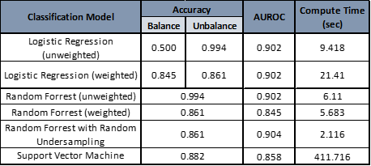
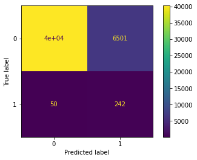

```{r setup, include=FALSE}
knitr::opts_chunk$set(echo = FALSE)

# Load dependencies 
library(reticulate) # For rendering Python code
```

## Abstract

European women face different abortion regimes, depending on their country of residence. Some countries have a more permissive approach to this issue and offer a safer environment to the women in need, but unfortunately, this is not the case everywhere [@EAAP]. Due to that fact, women in many European countries leave their countries of residence and endure cross-border travels in order to obtain better conditions for an abortion in neighbouring European countries. However, there is still little scientific understanding of these cross country abortion travels, starting with difficulties to even quantify the phenomenon.

This project aims to provide a pioneering approach on how to use machine learning models in order to estimate such abortion travels for the case of Germany. In the case of German States, distance to neighbouring countries, abortion policies in neighbouring countries, the fraction of the population with a migrant background, and the foreign population in the area could be some predictors to identify future pull factors for foreign abortion-seekers to come to Germany, for the procedure. In 2021, there were approximately 100,000 registered abortion procedures performed throughout the 16 federal states, with less than 1,000 registered to be from foreign women.

In the process of this research project, balanced and unbalanced Logistic Regression, Random Forrest, and Support Vector Machine classification models are fitted with a combined dataset in order to determine which one was the most accurate at predicting our variables of interest. Out of the three groups of examined variables, the models seem to suggest that the distance to other European countries has a higher incidence in the prediction of whether abortion was performed on a German or a foreign abortion-seeker in a German state.

[^1]: Europe Abortion Access Project (EAAP), 2020.

## Introduction / Background

There is a lot to be learnt from the Polish abortion laws about European morality policies, that debate policies touching on fundamental values. Despite its great overall impact on European politics, regarding morality policies, the European Union has remained mostly invisible. In an indirect fashion, however, open Schengen borders and Europeanization of related policies have eased the access for European citizens to other morality policy regimes. In turn, this means that *national capacities to effectively govern their population can be undermined by the access to more liberal regimes in fellow EU-countries*: If the Polish government further restricts access to abortion care, Polish women will seek this care in more permissive neighboring countries.

To quantify this effect, however, is a difficult task, given the absence of official statistics or border controls, and the desire of abortion-seeking women for discretion. The current project, therefore, proposes to approach in an indirect manner, based on the assumption that, *if a tighter abortion regime in country A causes women to cross borders to seek abortion care in country B, this should result in a higher number of abortions performed on foreigners in country B*.

In line with this thought, we present a Logistic Regression Model for Binary Classification model, Random Forrest Classifier, and a Support Vector Machine Model that predicts labels for abortions regarding whether they were performed on foreigners or members of the national population. The labeling is based on state-level information about abortion policies in neighboring countries, population share with a migrant background, and foreign population in the respective state. Given the feasibility limits in terms of time and data access, this project developed an initial framework based on German data on abortion statistics of the year 2021. The paper concludes with several promising avenues how to expand this approach in future research.
 

## Related Work

Morality policies are matters on which “at least a significant minority of citizens has a fundamental, first-principled conflict with the values embodied” [@Mooney], with abortion policies being a textbook example of such policies. Morality policymaking in a Europeanized context is an underrepresented strand of research within the respective literature [@ayoub2013cooperative], [@ayoub2014lgbt] – partly because, in contrast to the European integration process, they are seen as often non-economic in nature [@euchner2018conflict], [@schwartz2019rise].
An additional but crucial limitation comes into play when it comes to studies on cross country abortion travels: Abortion seeking women are often seek discretion, even more so when the respective abortion procedure is illegal in their country of origin. Furthermore, there are no Polish public records on how many citizens seek abortions abroad, nor are there official numbers on the German side on how many Polish women are taken in into German institutions that conduct abortions. Reviewing the literature in the field, researchers of the "Europe Abortion Access Project" conclude that the purpose of seeking abortion care abroad is a "phenomenon [that] remains poorly understood" [@EAAP]. They argue that the lack of scientific insight in this aspect of European abortion regimes is linked to a general lack of sufficient "quantitative and qualitative data" on the matter. Our research aims to contribute to a closure of this gap by developing a data-based model on abortion numbers from 2021 on the state-level within Germany.

By aiming to contribute to the body of quantitative studies on cross country abortion travels, this paper therefore aims to model human migration. Given the complexity entailed in the subject of human migration patterns, studies can benefit greatly from the predictive power of computational models. To understand how an issue as intricate can benefit from using machine learning models, previous attempts to tackle it had to be evaluated first. However, due to time and especially data limitations described in greater detail further below, sophisticated models such as XG-Boost models or artificial neural network models used in comparable migrant focused projects before [@Robinson], were not applicable in our project. Instead, this paper focused on wrangling the necessary data into a form that allow several basic models that can be further refined subsequently. These basic models showed - even on the very limited data sources at our hands - the potential of applications of classification models in the described context, that should be further explored.


## Proposed Method
 
The data available to us contains information on abortions per year per state. It distinguishes 'foreign' abortion-seekers ( without further information on the distribution of countries of origin), which enables us to create a binary classification model between 'foreign' and 'local'. Independent variables can be used to enable a Logistic Regression Model (LRM) and a Random Forrest Classifier (RFC) to estimate the probability that an event belongs to a specific class [@Géron]. In LRM, a statistical approach is used for classification problems and is used when the dependent variable (target) is categorical [@Logistic].  The probability of an event being of the intended class (binomial in this case) is calculated by the fitted model, trained with a portion of the available data, and if the probability is under or over a set threshold, the model will assign the corresponding class. On the other hand, the RFC will generate the most frequent answer to several  decision trees built with a random subset of features in order to select  the predicted class [@Random].

The binary dependent variable we are trying to predict is the type of abortion seeker (foreigner / german citizen) that have a procedure performed on them. In order to predict this variable, we developed the following Linear Regression Model:
$$
ln(\frac{p}{1-p})) = \beta_{0} + \sum_{i}^{26}\beta _{ia}X_{ia} + \sum_{i}^{62}\beta _{ib}X_{ib} + \sum_{i}^{62}\beta _{ic}X_{ic} + \epsilon
$$
The *a* group of variables involves the fraction of population of every German State with a migrant background. The *b* group of variables involves the fraction of foreign population residing in each German State. The *c* group of variables involve the average distance betweet the German states' capital cities and the primary cities of each European country. The countrys contained in *a* and *b* also include the abortion atlas policy index score for each country. 

The bias caused by the imbalanced nature of our dataset can influence RFC in such a way, that in the worst case scenario the minority class is ignored entirely. One approach to addressing the problem of class imbalance is to randomly resample the training dataset. The two main approaches to randomly resampling an imbalanced dataset are to delete examples from the majority class, called under sampling, and to duplicate examples from the minority class, called oversampling. In order to address the imbalance in our dataset we decided to use the undersampling method and thereby reduce the number of examples in the majority class. Since we not only have enough examples in the minority class but already a considerable number of values in the majority class with close to no explanatory value.  Therefore, it is not a limitation to use that this method might be deleting measurements that may be useful, important, or perhaps critical to fitting a robust decision boundary. 

Another method that we used in order to modify our RFC in such a way that it could handle the imbalanced classification is to change the weight that each class has when calculating the “impurity” score of a chosen split point. By doing so we ensured that the mixture of samples would be selected in favour of the minority class, allowing some false positives for the majority class. The BalancedRandomForestClassifier which we used can implement this directly from the imbalanced-learn library and performs random undersampling of the majority class in the meantime. 


## Experiments

### Data

1. **Abortion case numbers by the foreign and local population in the German States for the year 2021.** We use state level data on abortions performed in 2021 published by the German Statistical Office. Information on the origin of the patient is listed for the individual procedures, distinguishing between the various federal states and the category "foreigners". The data set contains information for all 16 federal states with about 100,000 abortions performed in Germany in 2021 [^1].

2. **Abortion Index Score of European Countries.** This Index is an initiative by the European Parliamentary Forum for Sexual and Reproductive Rights (EPF) and International Planned Parenthood Federation European Network (IPPF EN). It is an in-depth analysis of abortion policies for the Year 2021 across Europe, which scores 53 European countries and territories, taking into account, among other things, their respective legal frameworks and well as practical access to safe abortion care. The Atlas was designed by a group of experts in sexual and reproductive health and rights. They came up with an overall score on a scale from 0-100 composed of four sections with several sub-categories [^2].

3. **Foreign Population Distribution of German States.** The statistics on foreigners registered in Germany done by the Federal Statistical Office contain different representations of the regional distribution of the foreign population. Among other things, they provide for each federal state info on the foreign population in terms of sex, years of age and country of origin [^3].

4. **German Population with migrant background in the German States.** The so-called Mikrozensus (a census on a representation basis) of 2020 estimates on a state level the number of "Germans with a migrant background", defined as first or second generation migrants that possess the German citizenship and are therefore not considered as "foreigners". The data set contains an estimation of the number of citizens that have such a migrant background, distinguished by the respective country of origin. As the Mikrozensus operates based on estimations, only numbers for countries of origin with response rates above a statistically significant threshold are released by the authorities. The data set therefore does not contain information on each country of origin for each German state [^4].

5. **Geographical distance of German States to European Countries.** In order to calculate the distances between the 16 German States and the European countries, we created a data set with the geographic and demographic information needed. With this data set, we calculated the average distance between the German State's Capitals and the cities available in the data set from each one of the European countries, to sequential determine the respective distance between them [^5].

[^1]: https://www-genesis.destatis.de/genesis//online?operation=table&code=23311-0006&bypass=true&levelindex=1&levelid=1664961110565#abreadcrumb
[^2]: https://www.epfweb.org/node/857
[^3]: https://www-genesis.destatis.de/genesis/online#astructure
[^4]: https://www.bamf.de/DE/Themen/Forschung/Veroeffentlichungen/Migrationsbericht2020/PersonenMigrationshintergrund/personenmigrationshintergrund-node.html
[^5]: https://simplemaps.com/data/world-cities

In order to create the dataset needed to run the classification model, the transformed versions of foreign population, migrant background, distance to European countries, and abortion case numbers, all organized by the 16 federal states, were combined and cleaned. This was done by creating a naming convention that could be merged with every single dataset. We were then able to unpivot all dataframes from wide to long format, making each observation a state/country combination, instead of each observation a state with several countries as variables per single observation. We then created placeholder values within a new column "Country Score" in every dataset, which allowed us to insert for each observation the corresponding abortion score for the respective country. Then we sorted those in such a way that they would list for each state the individual foreign population, as well as the migrant population, replacing the placeholder country names with the value from the abortion atlas. In the end, we were able to combine all these datasets with the geographical data we had compiled for each federal state concerning the 31 surrounding countries. The resulting dataset contained a data point for each one of the abortion procedures performed in 2021 in the different German states, segregated by an identifier variable that differentiates between procedures performed on foreigners or locals.

Studying these datasets, a number of limitations become apparent. First and as expected, the distribution of abortions between "locals" and "foreigners" is extremly uneven. 99\% of the abortion procedures performed in German States were for domestic patients, so in order to be able to identify if we could explain the remaining 1\%, a balancing of the dataset had to be performed. With the help of class weights, the skewed distribution of the classes for this dataset can be modifyed in the classification models. This way, the training models can penalize the misclassification made towards the minority class (foreign patient) by setting a higher class weight and simultaneously reduce the weight for the majority class (domestic patient).

Secondly, all data sources used contain information exclusively on the state-level. This is true with regard to the dependent variable (abortions per state), and to all independent variables (migrant share, share of foreigners, distance to neighbouring countries). While we perform a number data wrangling steps as described in the final combined dataframe section above to pivot our dataframe to have individual abortions per row, these observations contain information on state level factors. For each observation, we have a state-level based combination of explanatory variables, and an outcome of either 0 (abortion conducted on a domestic woman), or 1 (abortion conducted on a foreign woman).  For the 16 German states and based on data from one year, this results in 32 different value combinations of independent and dependent variables distributed across 100.000 abortions. This small data set of distinct observations constitutes a de-facto reduction of value combinations and  drastically reduces the ability of models to make any robust classification predictions.

With the data at our hands, there is no feasible way around this problem: the inclusion of every additional country would mean a multiplication of the data wrangling process for the nationally organized data sources of the respective country regarding population and abortion statistics; an inclusion of abortions numbers from prior years is not possible since the Abortion Atlas was created for the first time in 2021. This makes the proposed *future* expansion to additional countries and subsequent years even more crucial: Including more entity-time combinations will add new value combinations (at the very least through changing Abortion Index Scores) that then increase the explanatory power of the models. As we show below, the first preliminary results of our models support the intuition of a relevant effect size especially of the explanatory geographic variable and the respective abortion score, subsequent research seems justified based on these findings. [@Analytics]

### Software
**GitHub** was used as the source code management software, used to host git repositories, store differente copies and version, and allow collaborative work between team members. [@GitHub]

**Google Colab** was used as the main python coding cloud app. It gave us access to runtimes of up to 12 hours of Google Compute Engines's GPU and TPU in order to run our python code. [@Google]

### Evaluation method
For the different machine learning models, we are using a balanced version of the **Accuracy score**, that takes into account the uneven class distribution of our sample,  **Confusion Matrix**, **Receiver Operating Characteristic (ROC) Curves**, and **F1 Score** to evaluate our results [@Evaluating]. The ROC helped us to generate a ratio of negative instances that are falsely classified as positive instances [@Géron], while a good F1 score would mean that a model has low false positives and low false negatives. since we wehre not able to generate sufficient F1 scores we decided to have a closer look at the top 15 most important features and compute the feature importance for each class separately.

### Experimental details
Since our dataset contains numeric variable values that are different in scale within our X values we decided to perform a standardization to have a common scale while building our machine learning model. Due to the fact that the most popular techniques for scaling numerical data prior to modeling is the StandardScaler we decided to start with that for our base line model. Because machine learning models learn from combining input variables to an output variable, differences in the scales across input variables may increase the difficulty of the problem being modeled. For the Logistic Regression Model had to set the maximum number of iterations needed to 1500. Furthermore we implemented from the Scikit-Learn library the internal "class\_weight" function in all of the evaluated models and used the train-test-split function so that we could fit and evaluate the model on separate chunks of the dataset.

After experiencing some issues with parameter and hyperparameter tuning for our Logistic Regression we decided to focuse on the Random Forest Classifier in order to further understand exactly what is being predicted. From sklearn.metrics we used accuracy\_score, confusion\_matrix, roc\_auc\_score, and classification\_report. Since our first unweighted Random Forest Model was only predicting class 0, and hence forth completely ignoring the minority class in favor of the majority class, we decided to introduce a class wight to our model. To then further improve our AUROC value we then used a Balanced Random Forest with Random Undersampling.

In order to better compare our results from Logistic Regression Model and the Random Forest Classifier, we decided to run a Support Vector Machine algorithm as well. We reported the performance of this model by calculating the mean area under the ROC curve, by gathering three repeats of 10-fold cross-validations.

### Results
After running the different model versions, we obtained the following results:

```{r fig3, eval = TRUE, echo = FALSE, out.width = '50%', fig.cap = "Results of Evaluated Models"}

```
```{r fig4, eval = TRUE, echo = FALSE, out.width = '50%', fig.cap = "Confusion Matrix of Random Forrest Classifier (weighted)"}

```
All of the confusion matrixes look like the weighted Random Forrest Classifier model. Models that include computanionally generated weights assign both labels, and with more than 40.000 abortions correctly predicted as performed on Germans, more than 80\% of the labels per class were attached correctly. Thanks to the weights attached to the classes, in a similar manner more than 80\% of the almost 300 abortions performed on foreigners were correctly predicted. Given that all of our variable opreate exclusively on the state-level, we consider this explanatory capacity of 80\% per class of our models a great success, especially compared to their unweighted counter parts.

### Comment on quantitative results
We were fully expecting that our unweighted models would not be able to predict the minority class, since we knew that our data was heavily skewed and therefore, unbalanced. At a first glance, however, all weighted and balanced models yielded better results than we expected since the accuracy score for all of our weighted models were in the high 80s, which were promising high explanatory values. However since accuracy is not a great measure of classifier performance when the classes are imbalanced, we also generated the Area under the Receiver Operating Characteristic (ROC) Curve, measuring the overall summary of diagnostic accuracy. Since the AUC equals 0.5 when the ROC curve corresponds to random chance and 1.0 for perfect accuracy, we were quite content at first with our results in the high 80s and low 90s.  However, as soon as we look at our F1 Scores, as well as the feature importance of our Model, we realised that these values did measure the performance of our Models accurately.

The poor performance of our model on these metrics shows that the low number of German states involved in combination with abortion indices for only a single year lays too heavily on the explanatory power of our models. We anticipated that this problem, which is inherent in our available data, might constitute a challenge for our project. Our models provide a satisfying answer to the class imbalance; however, the problems in the data structure itself could neither be avoided nor solved by the current means at our hand. Given that we have had only state-level data from the 16 German states available, and that we could therefore only combine a total of 32 value combinations.

We, therefore, consider the current state of our project a partial success nevertheless, given that we detected the hidden performance issues, and were able to identify and explain the issue as outlined in the analysis below. This in turn allowed us to identify clear strategies for solutions and further expansions in more resourceful project settings in the conclusive remarks of our project paper.

## Analysis

The particularities of our data discussed in earlier chapters are reflected in the results our models produce. Given the extreme imbalance of our data, unbalanced models behave essentially like dummy models: Aiming for high accuracy scores, they label every abortion as domestic without exception. This results in accuracy scores that are logically equal to the class distribution: less than 1\% of our data represents abortions performed on foreigners, thus labeling every abortion as domestic is a successful strategy in more than 99\% of the cases. In order to produce meaningful results, however, we have to focus on foreign abortions: Mislabeled German (domestically performed) abortions are less problematic than mislabeled foreign abortions. Our balanced models have more explanatory power because they can provide precisely this added value in comparison to the unbalanced classifiers. Following this focus on labeling foreign abortions, our preliminary factor analysis becomes relevant: While keeping the flaws of our models in mind, the most important factors among the interaction terms are pointing in a clear direction: 13 of the 15 most important independent variables are distance-based, if one considers predictive power for abortions on foreigners. Even though these insights must be taken with caution, they are in line with the initial intuition: Proximity to neighbouring countries in combination with the level of restrictiveness within these countries´ abortion regimes is a strong predictor for a high number of foreign abortions.

Going back to the paper´s starting assumption, this comes as no surprise: Berlin and Brandenburg, the closest states to Poland (a country with highly restrictive policies), have the highest number of foreign abortion seekers within Germany. States with big communities of Polish foreigners or Germans with Polish migrant backgrounds, however, such as North Rhine Westphalia, do not show higher numbers for abortions performed on foreigners, both in absolute and relative numbers. These two independent variables, people with migrant backgrounds and foreigners, seem to play only a minor role in explaining the cases of abortions performed on foreigners. While the data included needs to be expanded and diversified, there is a clear trend regarding what matters when it comes to explaining abortions performed on foreigners: proximity to neighbouring countries and the degree of restrictiveness of their respective abortion regimes.

## Conclusion

The project aimed to provide a classifier model that predicts labels for abortions in a binary fashion, as either being performed on German or non-German women. 
With models that include computationally generated weights, more than 80\% of the labels per class were attached correctly. Given the exclusively state-level nature of our data, this explanatory capacity is a remarkable success. Preliminary factor importance analysis furthermore suggests that of the three considered explanatory variables, geographical proximity combined with abortion restrictiveness scores is the decisive factor for these predictions, and migrant background share and foreign population are of little relevance.     
The poor performance indicated for instance by the F1 scores results from the flaws of our data structure. Variables that exclusively operate on a state level capture only 32 value combinations constitut a clear limitation to the models´ success. 
However, this clear identification of the source of problems - the low number of distinct value combinations - allows for three concrete suggestions for refined future research projects:
A first option would be to include data that operate on a lower level, ideally on the level of the individual abortion. The binary classifier logic we developed for this project would allow an easy incorporation of such information since the dataframe already lists one observation per abortion. However, such individual data on abortions is not publicly available, the only way to gain access to this type of information would therefore be through non-public channels.

A second option would be to include updated data on abortion numbers and abortion scores in upcoming years. Including abortion numbers from past years currently already available would not be sufficient for this: In order to generate new value combinations, the independent variables would need to change. Unfortunately, only the abortion numbers - so the binary dependent variable - are updated on an annual basis. Only subsequent editions of the first abortion atlas could provide new value combinations for our current independent variables populated by the German state.

The third and most promising approach would therefore be to expand the developed approach beyond the German states and include data from further European countries. Including state-level data from further countries would multiply the amount of value combination for each independent variable and improve our model drastically. Unfortunately, accessing and processing the required census and abortion data from additional European countries would certainly not have been feasible within this project, given the nationally specific data structure and the extremely time-consuming wrangling process. However, the first promising results of the present project might justify a subsequent project in order to further pursue the developed pioneering approach to quantify abortion migration across European borders by using classifier models.
